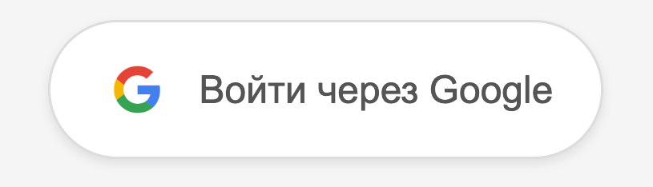

# OAuth2 Google Integration Project

A complete web application (Frontend + Backend) for user authentication through Google OAuth2 and accessing Google Calendar and Google Drive resources.



## 🚀 Project Overview

This project demonstrates a full-stack implementation of Google OAuth2 authentication with the following features:

- **User Authentication**: Secure login through Google OAuth2
- **Google Drive Integration**: Access and display user's Google Drive files
- **Google Calendar Integration**: Access user's calendar data
- **Modern UI**: Clean and responsive Vue.js frontend
- **RESTful API**: FastAPI backend with automatic documentation

## 🛠️ Tech Stack

### Backend

- **FastAPI** - Modern, fast web framework for building APIs
- **Python 3.12+** - Programming language
- **Uvicorn** - ASGI server for running FastAPI
- **PyJWT** - JWT token handling
- **aiohttp** - Async HTTP client for Google API calls

### Frontend

- **Vue.js 3** - Progressive JavaScript framework
- **Vite** - Fast build tool and development server
- **Vue Router** - Official router for Vue.js
- **Modern CSS** - Responsive design with gradients and animations

## 📋 Prerequisites

Before running this project, make sure you have:

- **Python 3.12+** installed ([Download here](https://python.org/))
- **Node.js 18+** and **npm** installed ([Download here](https://nodejs.org/en/download))
- **Google Cloud Console** account for OAuth2 credentials

## 🔧 Google OAuth2 Setup

### 1. Create Google Cloud Project

1. Go to [Google Cloud Console](https://console.cloud.google.com/)
2. Create a new project or select an existing one
3. Enable the following APIs:
   - **Google+ API** (for user profile information)
   - **Google Drive API** (for file access)
   - **Google Calendar API** (for calendar access)

### 2. Configure OAuth2 Credentials

1. Navigate to **APIs & Services** > **Credentials**
2. Click **Create Credentials** > **OAuth 2.0 Client IDs**
3. Select **Web application** as the application type
4. Add authorized redirect URIs:
   - `http://localhost:8000/auth/google/callback` (for backend)
   - `http://localhost:5173` (for frontend development)
5. Save and download the credentials

### 3. Environment Configuration

Create a `.env` file in the `backend` directory:

```env
OAUTH_GOOGLE_CLIENT_ID=your_google_client_id_here
OAUTH_GOOGLE_CLIENT_SECRET=your_google_client_secret_here
```

## 🚀 Getting Started

### Backend Setup

1. **Navigate to backend directory:**

   ```bash
   cd backend
   ```

2. **Create virtual environment:**

   ```bash
   python -m venv venv
   ```

3. **Activate virtual environment:**

   **Windows:**

   ```bash
   venv\Scripts\activate
   ```

   **macOS/Linux:**

   ```bash
   source venv/bin/activate
   ```

4. **Install dependencies:**

   ```bash
   pip install -r requirements.txt
   ```

5. **Run the backend server:**

   ```bash
   uvicorn main:app --reload --port 8000
   ```

   The backend will be available at `http://localhost:8000`

### Frontend Setup

1. **Navigate to frontend directory:**

   ```bash
   cd frontend
   ```

2. **Install dependencies:**

   ```bash
   npm install
   ```

3. **Run the development server:**

   ```bash
   npm run dev
   ```

   The frontend will be available at `http://localhost:5173`

## 📖 API Documentation

Once the backend is running, you can access:

- **Swagger UI**: `http://localhost:8000/docs` - Interactive API documentation
- **ReDoc**: `http://localhost:8000/redoc` - Alternative documentation format
- **OpenAPI JSON**: `http://localhost:8000/openapi.json` - API schema in JSON format

### Available Endpoints

- `GET /auth/google/url` - Get Google OAuth2 authorization URL
- `POST /auth/google/callback` - Handle OAuth2 callback and process user data

## 🎯 How It Works

### Authentication Flow

1. **User clicks "Login with Google"** on the frontend
2. **Frontend redirects** to backend `/auth/google/url` endpoint
3. **Backend generates** Google OAuth2 authorization URL with:
   - Client ID
   - Redirect URI
   - Required scopes (Drive, Calendar, Profile, Email)
   - Random state parameter for security
4. **User authorizes** the application on Google's consent screen
5. **Google redirects** back to `/auth/google/callback` with authorization code
6. **Backend exchanges** code for access token and user information
7. **Backend fetches** user's Google Drive files and profile data
8. **Frontend displays** the authenticated user's information and files

### Security Features

- **State Parameter**: Prevents CSRF attacks during OAuth flow
- **HTTPS**: Secure communication with Google APIs
- **Token Validation**: JWT token verification
- **CORS Configuration**: Proper cross-origin resource sharing setup

## 🔍 Project Structure

```
OAuth2_practice/
├── backend/
│   ├── main.py              # FastAPI application entry point
│   ├── router.py            # API routes and endpoints
│   ├── oauth_google.py      # Google OAuth2 logic
│   ├── config.py            # Configuration management
│   ├── state_storage.py     # State parameter storage
│   ├── requirements.txt     # Python dependencies
│   └── .env                 # Environment variables (create this)
├── frontend/
│   ├── src/
│   │   ├── components/
│   │   │   ├── Home.vue     # Main landing page
│   │   │   └── AuthGoogle.vue # OAuth callback handler
│   │   ├── App.vue          # Root Vue component
│   │   └── main.js          # Vue application entry point
│   ├── package.json         # Node.js dependencies
│   └── vite.config.js       # Vite configuration
├── docs/
│   └── vhod_s_google.png    # Project screenshot
├── SETUP.md                 # Detailed setup instructions
└── README.md               # This file
```

## 🐛 Troubleshooting

### Common Issues

**CORS Error:**

- Ensure backend is running on port 8000
- Ensure frontend is running on port 5173
- Check CORS configuration in `main.py`

**Invalid Redirect URI:**

- Verify redirect URI in Google Cloud Console matches exactly
- Check that the URI is `http://localhost:8000/auth/google/callback`

**State Parameter Error:**

- Reload the page and try again
- Check that state storage is working correctly

**Google API Errors:**

- Verify that required APIs are enabled in Google Cloud Console
- Check that OAuth2 credentials are correctly configured
- Ensure `.env` file contains valid client ID and secret

### Debug Mode

To run in debug mode with more verbose logging:

```bash
# Backend
uvicorn main:app --reload --port 8000 --log-level debug

# Frontend
npm run dev -- --debug
```

## 📚 Learning Resources

- [Google OAuth2 Documentation](https://developers.google.com/identity/protocols/oauth2)
- [FastAPI Documentation](https://fastapi.tiangolo.com/)
- [Vue.js Documentation](https://vuejs.org/)
- [Google Drive API](https://developers.google.com/drive/api)
- [Google Calendar API](https://developers.google.com/calendar/api)

## 🤝 Contributing

1. Fork the repository
2. Create a feature branch (`git checkout -b feature/amazing-feature`)
3. Commit your changes (`git commit -m 'Add some amazing feature'`)
4. Push to the branch (`git push origin feature/amazing-feature`)
5. Open a Pull Request

## 📄 License

This project is licensed under the MIT License - see the [LICENSE](LICENSE) file for details.

## 🙏 Acknowledgments

- Google for providing comprehensive OAuth2 and API documentation
- FastAPI team for the excellent web framework
- Vue.js team for the progressive JavaScript framework
- All contributors who helped improve this project

---

**Happy Coding! 🚀**
